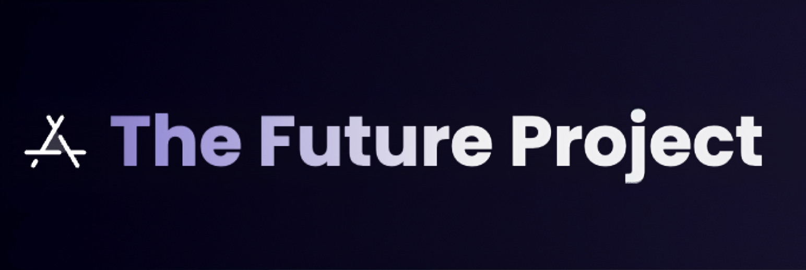

<p align="center">
  <a>
    
  </a>

</p>

<p align="center">
  <a href="https://github.com/thefutureproject-org/thefutureproject-API/contributors"></a>
  <a href="https://github.com/thefutureproject-org/thefutureproject-API/stargazers"></a>
  <a href="https://github.com/thefutureproject-org/thefutureproject-API/fork"></a>
  <a href="https://github.com/thefutureproject-org/thefutureproject-API/"></a>
  <a href="https://www.python.org/"></a>
  <a href="https://www.codefactor.io/repository/github/thefutureproject-org/thefutureproject-api/overview/main"></a>
  <a href="https://github.com/thefutureproject-org/thefutureproject-API/graphs/commit-activity/"></a>
  <a href="https://github.com/thefutureproject-org/thefutureproject-API"></a>
  <a href="https://makeapullrequest.com/"></a>
  <a href="https://github.com/thefutureproject-org/thefutureproject-API/blob/main/LICENSE"></a>

</p>

Building the foundations of tomorrow with the lightning speed of FastAPI.

---

## Installation

- Clone the repository:

```bash
git clone https://github.com/thefutureproject-org/thefutureproject-API.git
```

- Navigate to the project directory:

```bash
cd thefutureproject-API/
```

- Create a virtual env:

```bash
virtualenv -p /usr/bin/python3 venv
. ./venv/bin/activate
```

- Install dependencies:

```bash
pip(3) install -r requirements.txt
```

- Fill your details in a `.env` file

```bash
nano .env
```

The sample is given in [`.env.sample`](https://github.com/thefutureproject-org/thefutureproject-API/blob/main/.env.sample).
(You can either edit and rename the file or make a new file named `.env`.)

---

## Usage

- Run the FastAPI server:

```bash
uvicorn main:app --reload
```

- Open your web browser and navigate to `http://localhost:8000` to access the API.

---

## API Documentation

You can find the detailed API documentation by accessing the following endpoints:

- **Swagger UI**: `http://localhost:8000/docs`
- **ReDoc**: `http://localhost:8000/redoc`

---

## Contributing

If you'd like to contribute to this project, please follow these guidelines:

- Fork the repository
- Create your feature branch (`git checkout -b feature/YourFeature`)
- Commit your changes (`git commit -am 'Add some feature'`)
- Push to the branch (`git push origin feature/YourFeature`)
- Create a new Pull Request

Please refer to the [CONTRIBUTING.md](CONTRIBUTING.md) file for more details.

---

# License

[](LICENSE)  
The Future Project is licensed under [GNU Affero General Public License](https://www.gnu.org/licenses/agpl-3.0.en.html) v3 or later.
